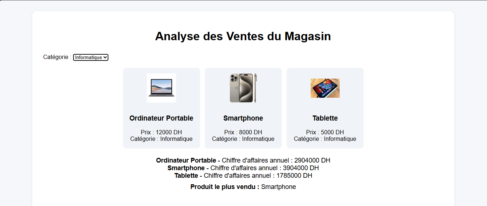

# 🏬 Store Sales Analytics Dashboard      


<p align="center">
  
</p>
<p align="center">
  
</p>

A fully interactive e-commerce sales analytics dashboard built with pure Vanilla JavaScript, featuring real-time data visualization and filtering capabilities.

---

## 📊 Features

- **Interactive Product Catalog**: Browse products with images, prices, and categories  
- **Real-time Filtering**: Filter products by category with instant updates  
- **Dynamic Charts**: Interactive line and pie charts using Chart.js  
- **Sales Analytics**: View monthly sales trends and annual revenue calculations  
- **Responsive Design**: Clean, modern UI that works on all devices  
- **JSON Data Integration**: Load product data from external JSON file  

---

## 🛠️ Technologies Used

- **HTML5** – Semantic markup structure  
- **CSS3** – Custom styling with Flexbox layout  
- **Vanilla JavaScript** – No frameworks or libraries  
- **Chart.js** – Data visualization  
- **Fetch API** – Asynchronous data loading  
- **JSON** – Structured product data storage  

---

## 📁 Project Structure

```
Online-Store-Vanilla-JS/
├── index.html
├── style.css
├── app.js
├── ventes.json
└── images/
```

---

## 🚀 Quick Start

1. Clone or download the project  
2. Open `index.html` in your browser  
3. Start exploring the dashboard  

---

## 📄 License

Open source – free to use for learning and portfolio purposes.

---

## 📄 Made by Me

This project was **designed, developed, and implemented entirely by me**.  
It demonstrates my skills in **Vanilla JavaScript, CSS, HTML, and data visualization**.  

<p align="center">
  <strong>👤 Ayoub Aguezar</strong>
</p>
<p align="center">
 
</p>


